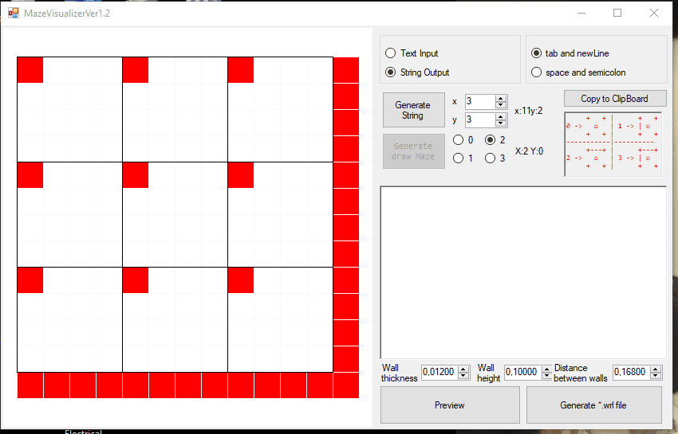
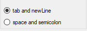
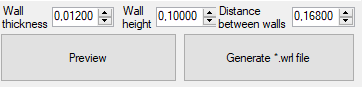

# Maze Generator
This application was created to build mazes in VRML (*.wrl) format.

I had used it to simulate in Matlab-Simulink the pathfinding and optimization of trajectory for a differential robot.

The Idea of generating the maze is the same as [this](https://www.mathworks.com/matlabcentral/cody/groups/33/problems/283).

Sorry for the unclean and no refactor code, I had written in a night to take me easy to create mazes as the Micromouse competition mazes.

# Prerequisites:

- Install any VRML Visualizer in your system. I used [this](http://freewrl.sourceforge.net/)
- Visual Studio Community 2015 or greater.

# How to use

I had implemented for two cases, when I created the mazes drawing in the panel, or writing in the text input a matrix with Matlab syntax.

Also, You can change the input-output matrix format in this groupBox:

You can change the dimensions of walls and columns for the maze.

 
# TODO:
- Refactor this code XD
- Change the default Robot in the WRL file
- Allow more mouse events to improve the drawing experience